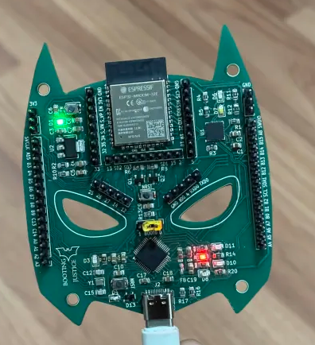

<h1 align="center">🚀 CustomBoot-32</h1>


<h2 align="center">✨ SRA Eklavya 2025</h2>


## 📑 Table of Contents
* [About the Project](#-about-the-project)  
  - [Aim](#aim)  
  - [Description](#description)  
  - [Tech-Stack](#tech-stack)  
  - [File Structure](#file-structure)  
* [Getting Started](#getting-started)  
  * [Installation](#installation)  
* [Usage](#usage)  
* [Results and Demo](#results-and-demo)  
* [Future Work](#future-work)  
* [Report](#report)
* [Troubleshooting](#troubleshooting)  
* [Contributors](#contributors)  
* [Mentors](#mentors)  
* [Resources](#resources)  
* [Acknowledgements](#acknowledgements)  

---

# ⭐ About the Project

## Aim
Designing a custom PCB with OTA support and a dual-image Bootloader using ESP32 WROOM-32E and STM32F103C8T6.

## Description
The project focuses on creating a custom PCB that integrates the Blue Pill (STM32F103C8T6) with ESP32 WROOM-32E.  
The ESP32 hosts a website, receives two firmwares via OTA, creates memory partitions, and initializes a File System in one of the partitions.  

On the STM side, a dual-image Bootloader requests firmware based on user input, verifies it, allocates it in flash memory, and executes it.  
The firmware transfer is carried out via **UART**.

## Tech-Stack
### Coding Language
<div style="display:flex; align-items:center; margin-bottom:8px;">
  
  <span style="background:#ff6f3c; color:white; padding:4px 10px; border-radius:4px; font-weight:bold;">
    Embedded C
  </span>
</div>


### Libraries
<div style="display:flex; align-items:center; margin-bottom:8px;">
  
  <span style="background:#ff6f3c; color:white; padding:4px 10px; border-radius:4px; font-weight:bold;">
    HAL
  </span>
</div>

<div style="display:flex; align-items:center; margin-bottom:8px;">
  
  <span style="background:#ff6f3c; color:white; padding:4px 10px; border-radius:4px; font-weight:bold;">
    LibOpenCM3
  </span>
</div>


### File Protocol
<div style="display:flex; align-items:center; margin-bottom:8px;">
  
  <span style="background:#ff6f3c; color:white; padding:4px 10px; border-radius:4px; font-weight:bold;">
    SPIFFS
  </span>
</div>

### Communication Protocols
<div style="display:flex; align-items:center; margin-bottom:8px;">
  
  <span style="background:#ff6f3c; color:white; padding:4px 10px; border-radius:4px; font-weight:bold;">
    UART
  </span>
</div>
<div style="display:flex; align-items:center; margin-bottom:8px;">
  
  <span style="background:#ff6f3c; color:white; padding:4px 10px; border-radius:4px; font-weight:bold;">
    OTA
  </span>
</div>
<br><br>

<br><br>

## 📁 File Structure

```
.
├── assets  #All images and test videos
│   ├── 2WayUART.mp4
│   ├── 3D-view back.png
│   ├── 3D-view.png
│   ├── EmbedC.png
│   ├── Final_PCB.png
│   ├── HAL.png
│   ├── LibOpenCM3.png
│   ├── OTA.png
│   ├── PCBSC1.png
│   ├── PCBSC2.png
│   ├── Routing.png
│   ├── SimpleBootloader.mp4
│   ├── SPIFFS.png
│   ├── UART.png
│   ├── website.png
│   ├── Wireless_CMD_Test.mp4
│   └── WorkingVideo.mp4
├── CustomBoot-32  #All the firmwares for both ESP as well as STM
│   ├── 1. OTA
│   ├── 2. Dual_Image_Bootloader
│   ├── 3. ESP_STM_UART1
│   ├── 4. ESP_STM_UART2
│   ├── 5. ESP_TO_STM_FIRMWARE_VIA_UART
│   ├── 6. ESP_STM_FILE_CRC
│   ├── 7. Controling_ESP_GPIO_Wirelessly
│   └── 8. Wireless_Firmware_Selection_ESP_STM(Additional)
├── Documentation  #Detailed documentation of the project
│   └── Final_DOC.pdf
├── Gerber files  #Files made for fabrication of PCB  
├── README.md
└── Schematic files  #Schematics of our PCB
    ├── 4 SRA.kicad_pcb
    ├── 4 SRA.kicad_sch
    └── untitled.kicad_sch


```

---

## 🚀 Getting Started

### Installation
1. Clone the repo  
   ```bash
   git clone https://github.com/avm1234567/Customboot-32.git
   ```
2. Navigate to the project directory  
   ```bash
   cd CustomBoot-32
   ```

---

## Usage

The codes used in our project are in the 'CustomBoot-32' directory. 

### 1. OTA

- From the CustomBoot-32 directory head to the OTA directory.
```
cd 1. OTA
```

- In the code enter the SSID and password of your wifi in line 16 and 17.
```
#define WIFI_SSID "Your_SSID"
#define WIFI_PASS "Your_Password"
```

- Then open ESP-IDF Powershell and build the project.
```
idf.py fullclean
idf.py build
```

- After the build is complete flash it.
```
idf.py flash monitor 
```

### 2. Dual_Image_Bootloader

- To generate the bin files open this project in STM32CubeIDE and build it 

- To flash this Code use STM32CubeProgrammer. Change your directory to Dual image bootloader directory. 

- After opening the directory first flash the LED_BLINK_2 bin file into STM-32 at the Start Address '0x08006000'. The path for the bin is: 
```
CustomBoot-32/2. Dual_Image_Bootloader/LED_BLINK_2/Debug/LED_BLINK_2.bin
```

- After flashing the first bin file flash the LED_BLINK bin file into STM-32 at the Start Address '0x08004000'. The path for the bin is:
```
CustomBoot-32/2. Dual_Image_Bootloader/LED_BLINK/Debug/LED_BLINK.bin
```

- Lastly, flash the Bootloader at the Start Address '0x08000000'. The path for the bin is:
```
CustomBoot-32/2. Dual_Image_Bootloader/Learning_Bootloader/Debug/Learning_Bootloader.bin
```

- Press the 'Start Programming' button to run the program.

### 3. ESP_STM_UART1

- To run the ESP side of the code change your directory to 'ESP_STM_COMM'.
```
cd 3. ESP_STM_UART1\ESP_STM_COMM
```

- After that build the code and flash it 
```
idf.py fullclean
idf.py build
idf.py flash monitor 
```

- To flash the STM code, open STM32CubeIDE and generate the build files.

- After generating flash the bin file into the STM using STM32CubeProgrammer at Start Address '0x08000000'

### 4. ESP_STM_UART2

- To run the ESP side of the code change your directory to 'ESP_STM_COMM'.
```
cd 3. ESP_STM_UART2\ESP_STM_COMM
```

- After that build the code and flash it 
```
idf.py fullclean
idf.py build
idf.py flash monitor 
```

- To flash the STM code, open STM32CubeIDE and generate the build files.

- After generating flash the bin file into the STM using STM32CubeProgrammer at Start Address '0x08000000'.

### 5. ESP_TO_STM_FIRMWARE_VIA_UART

-- To run the ESP side of the code change your directory to 'OTA'.
```
cd 5. ESP_TO_STM_FIRMWARE_VIA_UART\OTA
```

- After that build the code and flash it 
```
idf.py build
idf.py flash monitor 
```
 

- To flash the STM code, open STM32CubeIDE and generate the build files. You will find the bin files in the path
```
CustomBoot-32/5. ESP_TO_STM_FIRMWARE_VIA_UART/Learning_Bootloader/Debug/Learning_Bootloader.bin
```

- After generating flash the bin file into the STM using STM32CubeProgrammer at Start Address '0x08000000'.

### 6. ESP_STM_FILE CRC

- Download libopencm3 by cloning it to run bootloader file
```
git clone https://github.com/libopencm3/libopencm3.git
cd libopencm3
```
- After that flash the ESP32 in the directory
```
idf.py fullclean
CustomBoot-32/6. ESP_STM_FILE_CRC/OTA
idf.py build flash monitor
```

### 7. Controling_ESP_GPIO_Wirelessly
- Firstly fullclean, then build and flash the project.
```
idf.py fullclean
idf.py build
idf.py flash monitor
```

### 8. Wireless_Firmware_Selection
- Download libopencm3 by cloning it to run bootloader file
```
git clone https://github.com/libopencm3/libopencm3.git
cd libopencm3
```
- After that flash the ESP32 in the directory
```
idf.py fullclean
CustomBoot-32/8. Wireless_Firmware_Selection_ESP_STM(Additional)/OTA
idf.py build flash monitor
```


## 📸 Results

**Screenshot of our custom PCB:**  

|            Front            |            Back            |
| --------------------------- | -------------------------- |
|  |  |




## Demo:  
[Working Demo of final PCB](https://drive.google.com/file/d/1Z0VfDI0KjEA28zM6vQ-hMSaG2jekwzWR/view?usp=drive_link)  

For other results and test videos, please check our [Google Drive](https://drive.google.com/drive/folders/1JogM4m4yME66ZIJGMlyX8mcmxp7ndMSk?usp=drive_link).

## Report
Refer our own [report](https://drive.google.com/file/d/13CS2zIfVXfLGR-wP4OjCv9lpuOwN3wu8/view?usp=drive_link) of project where we explain the entire process in detail.

## 🛠 Troubleshooting
* ERC rule check errors in PCB schematics.  
* Routing issues in compact areas while adhering to manufacturer constraints.  
* Wi-Fi SSID and password options not appearing in Menuconfig.  
* CMakeLists errors affecting SPIFFS initialization.  
* Partition table not being detected.  
* SPIFFS initialization failure at runtime.  
* Favicon loading errors.  
* OTA binaries containing unnecessary bloatware.  
* UART initialization issues.  
* Binary file transfer failures.  
* Errors in custom file protocol implementation.  
* End-byte transmission errors during communication.  
* Application jump not functioning correctly (MSP not set).  
* Correct HAL-like application jump with LibOpenCM3.  
* Schematic issues resolved through perfboard prototyping and testing.  

---

## 👥 Contributors
* [Varun Patil](https://github.com/varun05050505)  
* [Omkar Nanajkar](https://github.com/nomkar24)  
* [Archit More](https://github.com/avm1234567)  

## 🎓 Mentors
* [Prithvi Tambewagh](https://github.com/rkt-1597)  
* [Shaunak Datar](https://github.com/ShaunakKDatar)  
* [Vishal Mutha](https://github.com/Vishal-Mutha)  

---

## 📚 Resources

- [Bootloader basics (EmbeTronicx)](https://embetronicx.com/tutorials/microcontrollers/stm32/bootloader/bootloader-basics/)  
- [EmbeddedInventor: Bootloader](https://embeddedinventor.com/embedded-bootloader-and-booting-process-explained/)  
- [Getting Started with STM32](https://youtube.com/playlist?list=PLNyfXcjhOAwO5HNTKpZPsqBhelLF2rWQx)  
- [Bare-metal UART STM32](https://vivonomicon.com/2020/06/28/bare-metal-stm32-programming-part-10-uart-communication/)  
- [ESP32 UART](https://docs.espressif.com/projects/esp-idf/en/stable/esp32/api-reference/peripherals/uart.html)  
- [CRC32 for STM](https://www.st.com/resource/en/application_note/an4187-using-the-stm32-hardware-crc-unit-stmicroelectronics.pdf)  
- [LibOpenCM3 documentation](https://libopencm3.org/docs/latest/stm32f1/html/modules.html)
- [SPIFFS](https://docs.espressif.com/projects/esp-idf/en/stable/esp32/api-reference/storage/spiffs.html)  
- [FreeRTOS](https://my-esp-idf.readthedocs.io/en/latest/api-guides/freertos-smp.html#tasks-and-task-creation)  
- [ESP Web Server Handling](https://esp32tutorials.com/esp32-web-server-esp-idf/)  
- [File Transfer Protocols](https://www.geeksforgeeks.org/computer-networks/xmodem-file-transfer-protocol/)

---

## 🙏 Acknowledgements
We are extremely grateful to our mentors – **Prithvi Tambewagh, Shaunak Datar, and Vishal Mutha** – for their guidance and support throughout the course of this project.  

We also thank [SRA-VJTI](https://sravjti.in/) for their support in organizing [Eklavya 2025](https://sravjti.in/projects/eklavya/) and for providing us the opportunity to work on this project.  
